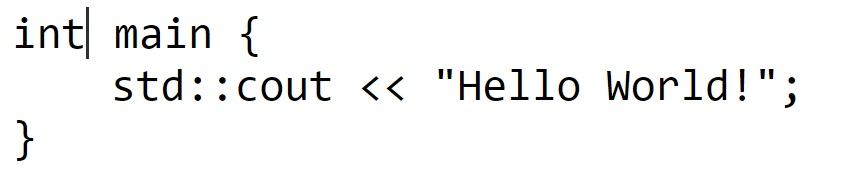

flexbox-based-text-editor
=========================
A flexbox approach to bypass weird keyboard behavior on mobile when using text editors. Intended to be integrated with on-screen keyboard. Under heavy development.

### Why this editor
- Normally web text editor works with keyboard events. This editor does not mess around with keyboard event at all. And it is easier / make more sense to start from scratch then forking an existing editor.

### Weird keyboard behavior
- [Unable to properly type or delete text when using monaco on Android · Issue #48 · microsoft/monaco-editor](https://github.com/microsoft/monaco-editor/issues/48)

### Demo (no `textarea`, `input` but only `div`s)

### Idea
- the content is stored in a string variable, do rendering to `div`s, cursoring according to some metadata
- edit the string variable programmatically (on-screen keyboard)

### Reference
- disable system keyboard
  - https://github.com/furcan/KioskBoard/blob/main/src/kioskboard.js
